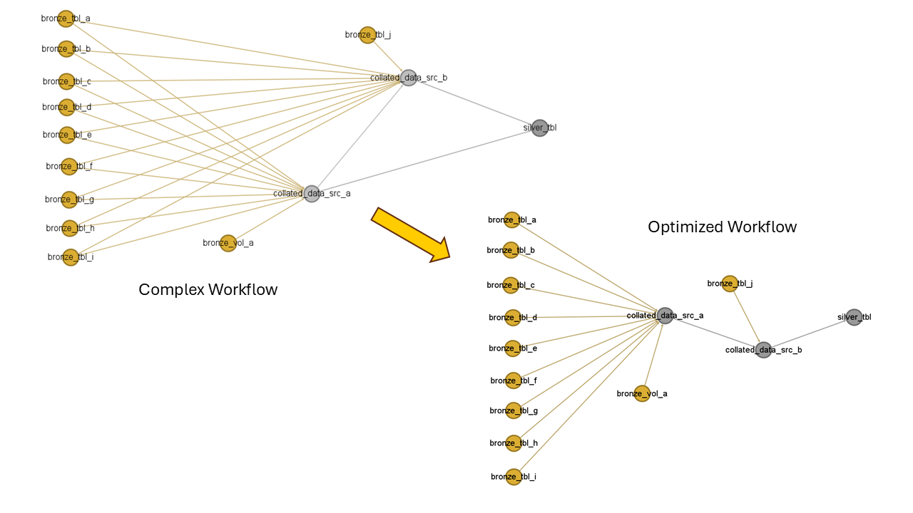
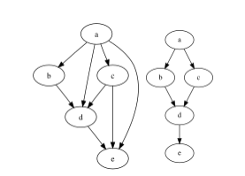
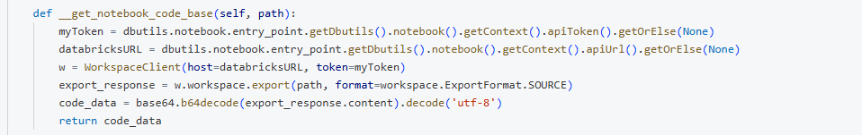
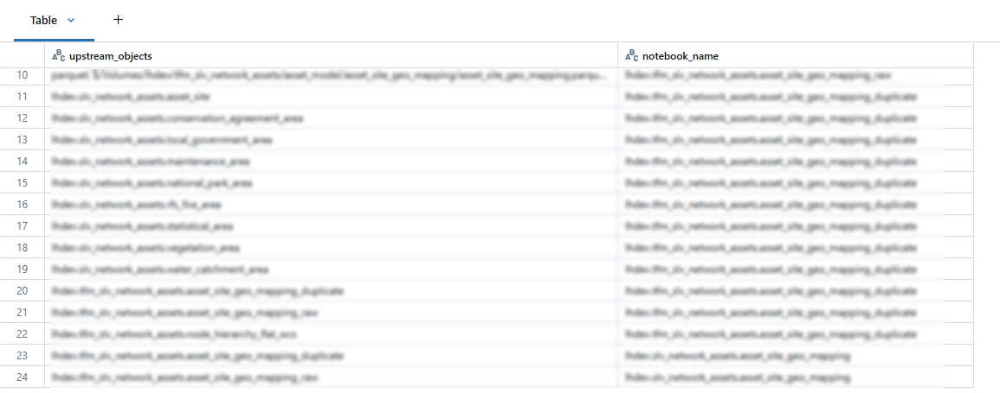
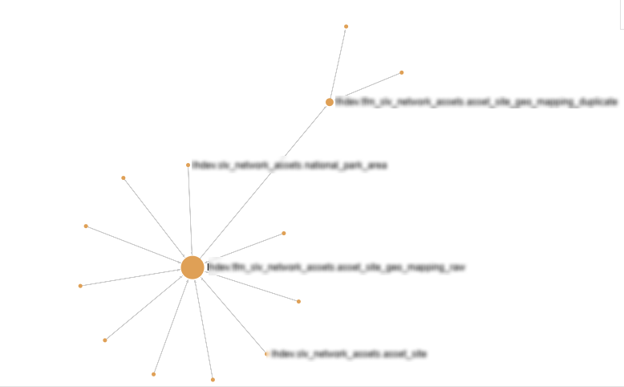

# Databricks - Table Dependency and Workflow Task Optimizer (Transitive Reduction)
*Your databricks python data transform script dependency scanner with workflow task optimizer via NetworkX*

#  What is it ???
This repository is designed and developed to support complex data transformation and modeling tasks by maximizing parallelized task execution and simplifying workflow task dependencies. 



In the above diagram, nodes are representative of notebook tasks in the databricks workflow.

In the representative workflow above, the bronze-colored nodes/tasks are computed first to prepare the necessary base tables. Afterward, the transform and silver tables are built upon these base tables.

Thus the tables *bronze_tbl_a..b..c...* feed the tables *collated_data_src_a* and *collated_data_src_b* and thus creating multiple dependencies

Once the *bronze* table nodes are computed and ready, the subsequent dependent *transform/silver* tables no longer require strict dependencies on them, thereby simplifying the workflow.

This is also called as [**Transitive Reduction Wikipedia**](https://en.wikipedia.org/wiki/Transitive_reduction).



# Prerequisite

In this repository, its assumed that one python notebook will be  responsible to create one sql object (like delta table). 
Thus multiple notebooks will represent multiple delta tables in the databricks, and this code will be evaluting dependency upon them and find the optimal order of execution of those notebooks.

> 1 notebook = 1 delta table

# Description

The python notebook in this repository performs 3 key task as follows:

1. Code Block for reading the python notebook source code in workspace



2. Analyzing the code base, and evaluating the upstream table/volume dependency for the notebook (Regex extraction and variable substitutions, recusrsivly)



3. This code can also resolve the variable chain in the Python notebook through recursive substitution. In this manner, the full path to the dynamic names is identified and returned as a dictionary.

```
notebook_name {'varaiable_1' : 'value_1 , 'variable_2' : 'value_2' , 'dynamic_variable' : '{varaiable_1}/path/folder'}

# Gets resolved via recursive substitution

notebook_name {'varaiable_1' : 'value_1 , 'variable_2' : 'value_2' , 'dynamic_variable' : 'value_1/path/folder'}

```

4. Creating a NetworkX DiGraph to plot the depedency graph and using the transitive reduction (pre-built) algo, to optimize the workflow task dependency for optimal execution of the notebook



# How to use it

The following code will create the dependency dataframe extracted from the target notebook list provided.

```
import os
import pandas as pd

notebook_list = [
    '/Workspace/Users/username@org.com.au/silver/silver_tbl',
    '/Workspace/Users/username@org.com.au/transform/collated_data_src_a',
    '/Workspace/Users/username@org.com.au/transform/collated_data_src_b'
]

dependency_dataframe = None
for pth in notebook_list:
    code_tracer = PySparkDependencyTracker(pth)
    upstream_obj = code_tracer.get_upstream_objects()
    print(code_tracer.notebook_name, code_tracer.notebookvariables)
    if len(upstream_obj) > 0:
        temp_df = pd.DataFrame(data={'upstream_objects' : upstream_obj})
        temp_df['notebook_name'] = code_tracer.notebook_table
        if dependency_dataframe is None:
            dependency_dataframe = temp_df
        else:
            dependency_dataframe = pd.concat([dependency_dataframe , temp_df], axis = 0)

    del code_tracer 
display(dependency_dataframe)
```

Once the depdency dataframe is obtain, the NetworkX graph is built by the following code

```
import networkx as nx
G = nx.DiGraph()

for n in dependency_dataframe['notebook_name'].unique():
    G.add_node(n)

for idx, row  in dependency_dataframe.iterrows():
    G.add_edge(row['upstream_objects'] , row['notebook_name'])

print(f'The graph has node count of {len(G.nodes())} and with edges {len(G.edges())}')

```

Then the transitive reduction function is applied to the graph to resolve the complexity and printed out by [ipysigma](https://github.com/medialab/ipysigma) package

```
#https://networkx.org/documentation/stable/reference/algorithms/generated/networkx.algorithms.dag.transitive_reduction.html
tr = nx.transitive_reduction(G)

from ipysigma import Sigma
Sigma(tr, node_size=g.degree, node_color='category')

```

# Summary

This codebase is an illustration of how we can optimize the workflows in the databricks eco-system. But this methdology is not limited to databricks, if we can obtain dependency task list in Airflow, SQL server jobs, snowflake and more. 

The transitive reuction would greatly help us to optimize & simplify the workflow for operational benefits.